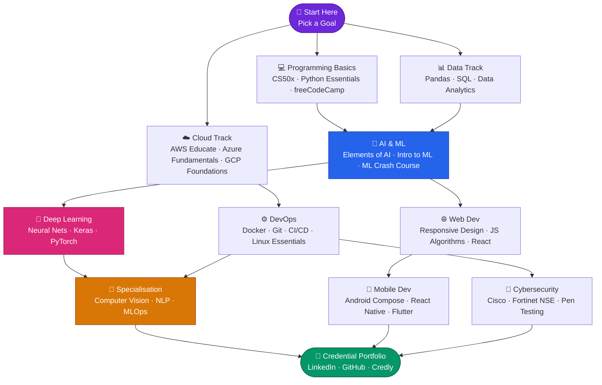

# 🎓 The Free Credential Index

### *Your Public Library of Knowledge Badges — Zero Cost, 100% Legitimate.*

> Think of this repo as a **librarian** who has already read every syllabus so you don't have to. Walk in, pick a shelf, and leave with a verifiable credential — free, forever.

 

 

**No paywalls. No "audit-only" traps. No credit card required.**
Every credential listed here issues a real, verifiable badge, certificate, or trophy — completely free.

---

## 🗺️ Table of Contents

| # | Category | Certs |
|:--|:---------|:-----:|
| 1 | [🤖 Artificial Intelligence & LLMs](#1-artificial-intelligence--llms) | 10 |
| 2 | [🧠 Machine Learning & Deep Learning](#2-machine-learning--deep-learning) | 10 |
| 3 | [📊 Data Science & Big Data](#3-data-science--big-data) | 10 |
| 4 | [📈 Data Analytics & Visualization](#4-data-analytics--visualization) | 10 |
| 5 | [💻 Programming & Software Development](#5-programming--software-development) | 10 |
| 6 | [🌐 Web Development](#6-web-development-front-end--back-end) | 10 |
| 7 | [☁️ Cloud Computing](#7-cloud-computing-azure-aws-google-cloud) | 10 |
| 8 | [🔐 Cybersecurity & Ethical Hacking](#8-cybersecurity--ethical-hacking) | 10 |
| 9 | [⚙️ DevOps & SRE](#9-devops--site-reliability-engineering-sre) | 10 |
| 10 | [📱 Mobile App Development](#10-mobile-app-development) | 10 |
| ✨ | [🌟 Bonus: Anthropic & Agentic AI](#bonus-anthropic-ai--agentic-workflows) | 5 |
| 💡 | [Pro-Tips: Get Paid Certs for Free](#-pro-tip-how-to-get-paid-certifications-for-free-in-2026) | — |

---

## 📖 How to Use This Repo (The Librarian's Guide)

Think of every **category** as a **section of the library**. You don't need to read the whole library — you walk to the shelf that matches your goal.

1. **🎯 Pick your shelf** — Use the Table of Contents above to jump to your area of interest.
2. **📋 Scan the table** — Each row is a book (cert). Look at the `Difficulty` and `Est. Time` columns to find one that fits your schedule.
3. **🔗 Click the link** — Every link drops you directly onto the enrollment page or the platform hub.
4. **🏅 Earn your badge** — Complete the course, pass the assessment (if any), and claim your free, shareable credential.
5. **🔄 Come back** — This repo is updated regularly. Star it so you never miss a new addition.

> [!IMPORTANT]
> **Disclaimer on Link Rot:** Tech platforms (especially IBM, Kaggle, and Cisco) frequently update their URL structures. If a link appears broken:
> 1. Use the **[Quick Hub Access](#provider-legend)** tags provided below every table to visit that provider's main course catalog.
> 2. Search for the **Certification Name** directly on their site.
> 3. Please **[Open a PR](#-contributing)** to help us update the link for the community!

> [!TIP]
> **New to tech?** Start with [CS50: Intro to Computer Science](#5-programming--software-development) from Harvard — it is the single most impactful free credential you can earn and covers everything from C to Python to SQL.

---

## 🗺️ Suggested Learning Path for Beginners

---

## Provider Legend

> [!NOTE]
> **Quick Access Enabled:** For every category table, we have provided clickable tags to the featured providers' **Catalog Hubs** directly below. If a deep-link breaks, use those hubs to find your course.

| Badge | Provider | Catalog Hub |
| :---: | :--- | :--- |
| 🟦 | **IBM** (Cognitive Class) | [cognitiveclass.ai/courses](https://cognitiveclass.ai/courses) |
| 🟨 | **Google** (Cloud Skills Boost) | [cloudskillsboost.google/catalog](https://www.cloudskillsboost.google/catalog) |
| 🟩 | **Microsoft** (Learn) | [learn.microsoft.com/training](https://learn.microsoft.com/en-us/training/browse/) |
| 🟧 | **AWS** (Educate / Builder) | [explore.skillbuilder.aws](https://explore.skillbuilder.aws) |
| 🔴 | **Cisco** (Skills for All) | [skillsforall.com/catalog](https://skillsforall.com/catalog) |
| 🟣 | **Harvard** (CS50) | [cs50.harvard.edu](https://cs50.harvard.edu/) |
| 🩵 | **freeCodeCamp** | [freecodecamp.org/learn](https://www.freecodecamp.org/learn/) |
| 🐱‍💻 | **Kaggle** | [kaggle.com/learn](https://www.kaggle.com/learn) |
| 🧡 | **Anthropic** | [anthropic.skilljar.com](https://anthropic.skilljar.com/) |
| 🩶 | **Others** (Univs, Fortinet, GLC) | — |

---

## 1. Artificial Intelligence & LLMs

> [!TIP]
> **Most Valuable Picks:** 🌟 **Elements of AI** (Helsinki) is the gold standard for building a real conceptual foundation. Pair it with 🌟 **Generative AI Fundamentals** (Google) for immediate practical value in 2026's job market.

| Provider | Certification Name | Difficulty | Est. Time | 🔗 Link |
| :--- | :--- | :---: | :---: | :--- |
| 🩶 Helsinki | Elements of AI | 🟢 Beginner | 30h | [elementsofai.com](https://www.elementsofai.com/) |
| 🟦 IBM | AI for Everyone | 🟢 Beginner | 10h | [cognitiveclass.ai](https://cognitiveclass.ai/courses/ai-for-everyone) |
| 🐱‍💻 Kaggle | Intro to Generative AI | 🟢 Beginner | 5h | [kaggle.com/learn/intro-to-generative-ai](https://www.kaggle.com/learn/intro-to-generative-ai) |
| 🔴 Cisco | Intro to Artificial Intelligence | 🟢 Beginner | 15h | [skillsforall.com](https://skillsforall.com/course/introduction-to-artificial-intelligence) |
| 🩶 Helsinki | Building AI | 🟡 Intermediate | 50h | [buildingai.elementsofai.com](https://buildingai.elementsofai.com/) |
| 🟦 IBM | IBM Watson Studio Basics | 🟡 Intermediate | 5h | [cognitiveclass.ai](https://cognitiveclass.ai/courses/data-science-hands-open-source-tools) |
| 🩶 Helsinki | Ethics of AI | 🟢 Beginner | 15h | [ethics-of-ai.mooc.fi](https://ethics-of-ai.mooc.fi/) |
| 🟨 Google | Generative AI Fundamentals | 🟢 Beginner | 8h | [cloudskillsboost.google/paths/118](https://www.cloudskillsboost.google/paths/118) |
| 🩶 DL.AI | Prompt Engineering for Developers | 🟡 Intermediate | 2h | [deeplearning.ai](https://www.deeplearning.ai/short-courses/chatgpt-prompt-engineering-for-developers/) |
| 🟩 MS | Build AI Apps with Semantic Kernel | 🟡 Intermediate | 4h | [learn.microsoft.com](https://learn.microsoft.com/en-us/training/paths/develop-ai-agents/) |

> **Quick Hub Access:** [🟦 IBM](https://cognitiveclass.ai/courses) · [🟨 Google](https://www.cloudskillsboost.google/catalog) · [🟩 Microsoft](https://learn.microsoft.com/en-us/training/browse/) · [🔴 Cisco](https://skillsforall.com/catalog) · [🐱‍💻 Kaggle](https://www.kaggle.com/learn)

---

## 2. Machine Learning & Deep Learning

> [!TIP]
> **Most Valuable Pick:** 🌟 **Machine Learning with Python** by freeCodeCamp remains a top recommendation for its 300+ hours of rigorous, project-based learning.

| Provider | Certification Name | Difficulty | Est. Time | 🔗 Link |
| :--- | :--- | :---: | :---: | :--- |
| 🐱‍💻 Kaggle | Intro to Machine Learning | 🟢 Beginner | 3h | [kaggle.com/learn/intro-to-machine-learning](https://www.kaggle.com/learn/intro-to-machine-learning) |
| 🐱‍💻 Kaggle | Intermediate Machine Learning | 🟡 Intermediate | 4h | [kaggle.com/learn/intermediate-machine-learning](https://www.kaggle.com/learn/intermediate-machine-learning) |
| 🐱‍💻 Kaggle | Intro to Deep Learning | 🟡 Intermediate | 4h | [kaggle.com/learn/intro-to-deep-learning](https://www.kaggle.com/learn/intro-to-deep-learning) |
| 🐱‍💻 Kaggle | Computer Vision | 🟡 Intermediate | 4h | [kaggle.com/learn/computer-vision](https://www.kaggle.com/learn/computer-vision) |
| 🟨 Google | Machine Learning Crash Course | 🟡 Intermediate | 15h | [developers.google.com](https://developers.google.com/machine-learning/crash-course) |
| 🩵 fCC | Machine Learning with Python | 🟡 Intermediate | 300h | [freecodecamp.org](https://www.freecodecamp.org/learn/machine-learning-with-python/) |
| 🟦 IBM | Machine Learning with Python | 🟢 Beginner | 13h | [cognitiveclass.ai](https://cognitiveclass.ai/courses/machine-learning-with-python) |
| 🟦 IBM | Deep Learning Fundamentals | 🟡 Intermediate | 12h | [cognitiveclass.ai](https://cognitiveclass.ai/courses/introduction-deep-learning) |
| 🟦 IBM | Deep Learning with PyTorch | 🔴 Advanced | 15h | [cognitiveclass.ai](https://cognitiveclass.ai/courses/deep-learning-pytorch) |
| 🩶 DL.AI | ML Data Lifecycle in Production | 🟡 Intermediate | 5h | [deeplearning.ai](https://www.deeplearning.ai/short-courses/) |

> **Quick Hub Access:** [🟦 IBM](https://cognitiveclass.ai/courses) · [🟨 Google](https://www.cloudskillsboost.google/catalog) · [🩵 freeCodeCamp](https://www.freecodecamp.org/learn/) · [🐱‍💻 Kaggle](https://www.kaggle.com/learn)

---

## 3. Data Science & Big Data

> [!TIP]
> **Most Valuable Pick:** 🌟 **CS50's Intro to AI with Python** (Harvard) combines academic rigor with practical Python skills.

| Provider | Certification Name | Difficulty | Est. Time | 🔗 Link |
| :--- | :--- | :---: | :---: | :--- |
| 🟦 IBM | Data Science Fundamentals | 🟢 Beginner | 15h | [cognitiveclass.ai](https://cognitiveclass.ai/learn/data-science) |
| 🔴 Cisco | Intro to Data Science | 🟢 Beginner | 6h | [skillsforall.com](https://skillsforall.com/course/introduction-data-science) |
| 🐱‍💻 Kaggle | Feature Engineering | 🟡 Intermediate | 4h | [kaggle.com/learn/feature-engineering](https://www.kaggle.com/learn/feature-engineering) |
| 🐱‍💻 Kaggle | Time Series | 🟡 Intermediate | 4h | [kaggle.com/learn/time-series](https://www.kaggle.com/learn/time-series) |
| 🐱‍💻 Kaggle | Geospatial Analysis | 🟡 Intermediate | 4h | [kaggle.com/learn/geospatial-analysis](https://www.kaggle.com/learn/geospatial-analysis) |
| 🟦 IBM | Big Data 101 | 🟢 Beginner | 3h | [cognitiveclass.ai](https://cognitiveclass.ai/courses/what-is-big-data) |
| 🟦 IBM | Hadoop Fundamentals I | 🟡 Intermediate | 13h | [cognitiveclass.ai](https://cognitiveclass.ai/courses/hadoop-101) |
| 🟦 IBM | Spark Fundamentals I | 🟡 Intermediate | 13h | [cognitiveclass.ai](https://cognitiveclass.ai/courses/spark-fundamentals) |
| 🟣 Harvard | CS50's Intro to AI with Python | 🟢 Beginner | 30h | [cs50.harvard.edu/ai](https://cs50.harvard.edu/ai/) |
| 🟦 IBM | Text Analytics 101 | 🟡 Intermediate | 5h | [cognitiveclass.ai](https://cognitiveclass.ai/courses/text-analytics-101) |

> **Quick Hub Access:** [🟦 IBM](https://cognitiveclass.ai/courses) · [🔴 Cisco](https://skillsforall.com/catalog) · [🟣 Harvard](https://cs50.harvard.edu/) · [🐱‍💻 Kaggle](https://www.kaggle.com/learn)

---

## 4. Data Analytics & Visualization

| Provider | Certification Name | Difficulty | Est. Time | 🔗 Link |
| :--- | :--- | :---: | :---: | :--- |
| 🩵 fCC | Data Analysis with Python | 🟡 Intermediate | 300h | [freecodecamp.org](https://www.freecodecamp.org/learn/data-analysis-with-python/) |
| 🐱‍💻 Kaggle | Pandas | 🟢 Beginner | 4h | [kaggle.com/learn/pandas](https://www.kaggle.com/learn/pandas) |
| 🐱‍💻 Kaggle | Data Visualization | 🟢 Beginner | 4h | [kaggle.com/learn/data-visualization](https://www.kaggle.com/learn/data-visualization) |
| 🐱‍💻 Kaggle | Intro to SQL | 🟢 Beginner | 3h | [kaggle.com/learn/intro-to-sql](https://www.kaggle.com/learn/intro-to-sql) |
| 🐱‍💻 Kaggle | Advanced SQL | 🟡 Intermediate | 4h | [kaggle.com/learn/advanced-sql](https://www.kaggle.com/learn/advanced-sql) |
| 🔴 Cisco | Data Analytics Essentials | 🟢 Beginner | 30h | [skillsforall.com](https://skillsforall.com/course/data-analytics-essentials) |
| 🟦 IBM | Data Visualization with Python | 🟡 Intermediate | 18h | [cognitiveclass.ai](https://cognitiveclass.ai/courses/data-visualization-python) |
| 🟨 Google | Google Analytics Certification | 🟢 Beginner | 5h | [skillshop.exceedlms.com](https://skillshop.exceedlms.com/student/catalog/list?category_ids=6431) |
| 🟦 IBM | SQL and Relational Databases 101 | 🟢 Beginner | 16h | [cognitiveclass.ai](https://cognitiveclass.ai/courses/learn-sql-relational-databases) |
| 🐱‍💻 Kaggle | Data Cleaning | 🟡 Intermediate | 3h | [kaggle.com/learn/data-cleaning](https://www.kaggle.com/learn/data-cleaning) |

> **Quick Hub Access:** [🟦 IBM](https://cognitiveclass.ai/courses) · [🟨 Google](https://www.cloudskillsboost.google/catalog) · [🔴 Cisco](https://skillsforall.com/catalog) · [🩵 freeCodeCamp](https://www.freecodecamp.org/learn/) · [🐱‍💻 Kaggle](https://www.kaggle.com/learn)

---

## 5. Programming & Software Development

> [!TIP]
> **Most Valuable Pick:** **CS50 (Harvard)** is widely considered the best programming course ever created—now also free to earn its completion certificate.

| Provider | Certification Name | Difficulty | Est. Time | 🔗 Link |
| :--- | :--- | :---: | :---: | :--- |
| 🟣 Harvard | CS50: Intro to Computer Science | 🟢 Beginner | 120h | [cs50.harvard.edu/x](https://cs50.harvard.edu/x/) |
| 🩵 fCC | Scientific Computing with Python | 🟢 Beginner | 300h | [freecodecamp.org](https://www.freecodecamp.org/learn/scientific-computing-with-python/) |
| 🩵 fCC / 🟩 MS | Foundational C# with Microsoft | 🟢 Beginner | 300h | [freecodecamp.org](https://www.freecodecamp.org/learn/foundational-c-sharp-with-microsoft/) |
| 🐱‍💻 Kaggle | Python | 🟢 Beginner | 5h | [kaggle.com/learn/python](https://www.kaggle.com/learn/python) |
| 🔴 Cisco | Python Essentials 1 | 🟢 Beginner | 30h | [skillsforall.com/catalog](https://skillsforall.com/catalog) |
| 🔴 Cisco | Python Essentials 2 | 🟡 Intermediate | 40h | [skillsforall.com/catalog](https://skillsforall.com/catalog) |
| 🔴 Cisco | Programming Essentials in C++ | 🟢 Beginner | 70h | [skillsforall.com/catalog](https://skillsforall.com/catalog) |
| 🟦 IBM | Go (Golang) Basics | 🟢 Beginner | 10h | [cognitiveclass.ai](https://cognitiveclass.ai/courses/go-basics) |
| 🟦 IBM | Reactive Architecture: Intro | 🟡 Intermediate | 6h | [cognitiveclass.ai](https://cognitiveclass.ai/courses/reactive-architecture-introduction) |
| 🩶 GLC | Java Tutorial Certificate | 🟢 Beginner | 4h | [mygreatlearning.com](https://www.mygreatlearning.com/academy/learn-for-free/courses/java-programming) |

> **Quick Hub Access:** [🟦 IBM](https://cognitiveclass.ai/courses) · [🟩 Microsoft](https://learn.microsoft.com/en-us/training/browse/) · [🔴 Cisco](https://skillsforall.com/catalog) · [🟣 Harvard](https://cs50.harvard.edu/) · [🩵 freeCodeCamp](https://www.freecodecamp.org/learn/) · [🐱‍💻 Kaggle](https://www.kaggle.com/learn)

---

## 6. Web Development (Front-end & Back-end)

| Provider | Certification Name | Difficulty | Est. Time | 🔗 Link |
| :--- | :--- | :---: | :---: | :--- |
| 🩵 fCC | Responsive Web Design | 🟢 Beginner | 300h | [freecodecamp.org](https://www.freecodecamp.org/learn/2022/responsive-web-design/) |
| 🩵 fCC | JS Algorithms & Data Structures | 🟡 Intermediate | 300h | [freecodecamp.org](https://www.freecodecamp.org/learn/javascript-algorithms-and-data-structures-v8/) |
| 🩵 fCC | Front End Development Libraries | 🟡 Intermediate | 300h | [freecodecamp.org](https://www.freecodecamp.org/learn/front-end-development-libraries/) |
| 🩵 fCC | Back End Development and APIs | 🔴 Advanced | 300h | [freecodecamp.org](https://www.freecodecamp.org/learn/back-end-development-and-apis/) |
| 🩵 fCC | Relational Database | 🔴 Advanced | 300h | [freecodecamp.org](https://www.freecodecamp.org/learn/relational-database/) |
| 🟣 Harvard | Web Programming with Python & JS | 🟡 Intermediate | 60h | [cs50.harvard.edu/web](https://cs50.harvard.edu/web/) |
| 🟩 MS | Build Web Apps with Blazor | 🟢 Beginner | 5h | [learn.microsoft.com](https://learn.microsoft.com/en-us/training/paths/build-web-apps-with-blazor/) |
| 🩵 fCC | Information Security | 🔴 Advanced | 300h | [freecodecamp.org](https://www.freecodecamp.org/learn/information-security/) |
| 🩵 fCC | Quality Assurance | 🔴 Advanced | 300h | [freecodecamp.org](https://www.freecodecamp.org/learn/quality-assurance/) |
| 🟩 MS | Build a Web API with ASP.NET | 🟢 Beginner | 4h | [learn.microsoft.com](https://learn.microsoft.com/en-us/training/paths/aspnet-core-web-api/) |

> **Quick Hub Access:** [🟩 Microsoft](https://learn.microsoft.com/en-us/training/browse/) · [🟣 Harvard](https://cs50.harvard.edu/) · [🩵 freeCodeCamp](https://www.freecodecamp.org/learn/)

---

## 7. Cloud Computing (Azure, AWS, Google Cloud)

| Provider | Certification Name | Difficulty | Est. Time | 🔗 Link |
| :--- | :--- | :---: | :---: | :--- |
| 🟧 AWS | AWS Cloud Practitioner Badge | 🟢 Beginner | 15h | [aws.amazon.com/education/awseducate](https://aws.amazon.com/education/awseducate/) |
| 🟩 MS | Azure Fundamentals Badge | 🟢 Beginner | 10h | [learn.microsoft.com](https://learn.microsoft.com/en-us/training/paths/microsoft-azure-fundamentals-describe-cloud-concepts/) |
| 🟨 Google | Cloud Computing Foundations | 🟢 Beginner | 20h | [cloudskillsboost.google](https://www.cloudskillsboost.google/paths/11) |
| 🟦 IBM | IBM Cloud Essentials | 🟢 Beginner | 6h | [cognitiveclass.ai](https://cognitiveclass.ai/courses/ibm-cloud-essentials) |
| 🟦 IBM | Serverless Computing using Cloud | 🟡 Intermediate | 5h | [cognitiveclass.ai](https://cognitiveclass.ai/courses/serverless-computing) |
| 🟦 IBM | Cloud Core | 🟢 Beginner | 5h | [cognitiveclass.ai](https://cognitiveclass.ai/courses/introduction-to-cloud) |
| 🟦 IBM | Container & Kubernetes Essentials | 🟡 Intermediate | 15h | [cognitiveclass.ai](https://cognitiveclass.ai/courses/kubernetes-course) |
| 🟦 IBM | Cloud Architecture Foundations | 🟡 Intermediate | 10h | [cognitiveclass.ai](https://cognitiveclass.ai/courses/cloud-architecture-foundations) |
| 🟩 MS | Administer Active Directory | 🟡 Intermediate | 6h | [learn.microsoft.com](https://learn.microsoft.com/en-us/training/paths/active-directory-domain-services/) |
| 🟧 AWS | AWS Getting Started | 🟢 Beginner | 5h | [explore.skillbuilder.aws](https://explore.skillbuilder.aws) |

> **Quick Hub Access:** [🟦 IBM](https://cognitiveclass.ai/courses) · [🟨 Google](https://www.cloudskillsboost.google/catalog) · [🟩 Microsoft](https://learn.microsoft.com/en-us/training/browse/) · [🟧 AWS](https://explore.skillbuilder.aws)

---

## 8. Cybersecurity & Ethical Hacking

| Provider | Certification Name | Difficulty | Est. Time | 🔗 Link |
| :--- | :--- | :---: | :---: | :--- |
| 🔴 Cisco | Intro to Cybersecurity | 🟢 Beginner | 15h | [skillsforall.com](https://skillsforall.com/course/introduction-to-cybersecurity) |
| 🔴 Cisco | Cybersecurity Essentials | 🟡 Intermediate | 30h | [skillsforall.com](https://skillsforall.com/course/cybersecurity-essentials) |
| 🩶 Fortinet | Info Security Awareness (NSE 1) | 🟢 Beginner | 2h | [training.fortinet.com](https://training.fortinet.com/) |
| 🩶 Fortinet | Evolution of Cybersecurity (NSE 2) | 🟡 Intermediate | 4h | [training.fortinet.com](https://training.fortinet.com/) |
| 🔴 Cisco | Endpoint Security | 🟡 Intermediate | 27h | [skillsforall.com](https://skillsforall.com/course/endpoint-security) |
| 🔴 Cisco | Network Defense | 🟡 Intermediate | 27h | [skillsforall.com](https://skillsforall.com/course/network-defense) |
| 🔴 Cisco | Cyber Threat Management | 🔴 Advanced | 16h | [skillsforall.com](https://skillsforall.com/course/cyber-threat-management) |
| 🟩 MS | Describe Security Concepts | 🟡 Intermediate | 5h | [learn.microsoft.com](https://learn.microsoft.com/en-us/training/paths/describe-security-concepts/) |
| 🩶 GLC | Ethical Hacking Essentials | 🟢 Beginner | 15h | [mygreatlearning.com/academy](https://www.mygreatlearning.com/academy/learn-for-free/courses/ethical-hacking-basics) |
| 🩶 U.Maryland | Intro to Hardware Security | 🔴 Advanced | 12h | [coursera.org](https://www.coursera.org/learn/hardware-security) |

> **Quick Hub Access:** [🟩 Microsoft](https://learn.microsoft.com/en-us/training/browse/) · [🔴 Cisco](https://skillsforall.com/catalog) · [🩶 Fortinet](https://training.fortinet.com/)

---

## 9. DevOps & Site Reliability Engineering (SRE)

| Provider | Certification Name | Difficulty | Est. Time | 🔗 Link |
| :--- | :--- | :---: | :---: | :--- |
| 🟦 IBM | Docker Essentials | 🟢 Beginner | 5h | [cognitiveclass.ai](https://cognitiveclass.ai/courses/docker-essentials) |
| 🟦 IBM | Build Kubernetes Operators | 🟡 Intermediate | 4h | [cognitiveclass.ai](https://cognitiveclass.ai/courses/build-kubernetes-operators) |
| 🔴 Cisco | NDG Linux Unhatched | 🟢 Beginner | 8h | [skillsforall.com](https://skillsforall.com/course/linux-unhatched) |
| 🔴 Cisco | NDG Linux Essentials | 🟡 Intermediate | 70h | [skillsforall.com](https://skillsforall.com/course/linux-essentials) |
| 🟩 MS | Automate Deployments with GitHub | 🟢 Beginner | 4h | [learn.microsoft.com](https://learn.microsoft.com/en-us/training/paths/automate-deployments-github-actions/) |
| 🩶 GLC | DevOps Foundations | 🟡 Intermediate | 4h | [mygreatlearning.com/academy](https://www.mygreatlearning.com/academy/learn-for-free/courses/devops-foundations) |
| 🩶 GLC | Version Control with Git | 🟢 Beginner | 3h | [mygreatlearning.com/academy](https://www.mygreatlearning.com/academy/learn-for-free/courses/git-and-github-crash-course) |
| 🟩 MS | Implement CI/CD with Azure | 🟡 Intermediate | 5h | [learn.microsoft.com](https://learn.microsoft.com/en-us/training/paths/implement-ci-cd-azure-devops/) |
| 🩶 GLC | SRE Basics | 🟡 Intermediate | 3h | [mygreatlearning.com/academy](https://www.mygreatlearning.com/academy/learn-for-free/courses/site-reliability-engineering) |
| 🩶 GLC | Ansible Basics | 🔴 Advanced | 2h | [mygreatlearning.com/academy](https://www.mygreatlearning.com/academy/learn-for-free/courses/ansible-basics) |

> **Quick Hub Access:** [🟦 IBM](https://cognitiveclass.ai/courses) · [🟩 Microsoft](https://learn.microsoft.com/en-us/training/browse/) · [🔴 Cisco](https://skillsforall.com/catalog)

---

## 10. Mobile App Development

| Provider | Certification Name | Difficulty | Est. Time | 🔗 Link |
| :--- | :--- | :---: | :---: | :--- |
| 🟨 Google | Android Basics with Compose | 🟢 Beginner | 50h | [developer.android.com/courses](https://developer.android.com/courses/android-basics-compose/course) |
| 🟨 Google | Advanced Android in Kotlin | 🟡 Intermediate | 30h | [developer.android.com/courses](https://developer.android.com/courses/advanced-training/overview) |
| 🟣 Harvard | CS50's Intro to Game Development | 🟢 Beginner | 60h | [cs50.harvard.edu/games](https://cs50.harvard.edu/games/) |
| 🟩 MS | Build Mobile Apps with .NET MAUI | 🟢 Beginner | 8h | [learn.microsoft.com](https://learn.microsoft.com/en-us/training/paths/build-apps-with-dotnet-maui/) |
| 🩶 GLC | React Native Fundamentals | 🟢 Beginner | 3h | [mygreatlearning.com/academy](https://www.mygreatlearning.com/academy/learn-for-free/courses/react-native) |
| 🩶 GLC | iOS App Development Basics | 🟢 Beginner | 3h | [mygreatlearning.com/academy](https://www.mygreatlearning.com/academy/learn-for-free/courses/ios-app-development-basics) |
| 🩶 GLC | Flutter Basics | 🟢 Beginner | 2h | [mygreatlearning.com/academy](https://www.mygreatlearning.com/academy/learn-for-free/courses/flutter-basics) |
| 🟨 Google | Kotlin Bootcamp for Programmers | 🟢 Beginner | 15h | [developer.android.com/courses](https://developer.android.com/courses/kotlin-bootcamp/overview) |
| 🩶 GLC | Mobile App Dev with Python | 🟡 Intermediate | 2h | [mygreatlearning.com/academy](https://www.mygreatlearning.com/academy/learn-for-free/courses/mobile-app-development-with-python) |
| 🟨 Google | Architecture Components | 🔴 Advanced | 10h | [developer.android.com/courses](https://developer.android.com/courses/architecture-components/overview) |

> **Quick Hub Access:** [🟨 Google](https://www.cloudskillsboost.google/catalog) · [🟩 Microsoft](https://learn.microsoft.com/en-us/training/browse/) · [🟣 Harvard](https://cs50.harvard.edu/)

---

## Bonus: Anthropic AI & Agentic Workflows

| Provider | Certification Name | Difficulty | Est. Time | 🔗 Link |
| :--- | :--- | :---: | :---: | :--- |
| 🧡 Anthropic | Claude 101 | 🟢 Beginner | 1h | [anthropic.skilljar.com](https://anthropic.skilljar.com/) |
| 🧡 Anthropic | AI Fluency: Framework | 🟢 Beginner | 1h | [anthropic.skilljar.com](https://anthropic.skilljar.com/) |
| 🧡 Anthropic | Building with Claude API | 🟡 Intermediate | 8h | [anthropic.skilljar.com](https://anthropic.skilljar.com/) |
| 🧡 Anthropic | Intro to MCP | 🟡 Intermediate | 3h | [anthropic.skilljar.com](https://anthropic.skilljar.com/) |
| 🧡 Anthropic | Claude Code in Action | 🔴 Advanced | 5h | [anthropic.skilljar.com/claude-code-in-action](https://anthropic.skilljar.com/claude-code-in-action) |

> **Quick Hub Access:** [🧡 Anthropic](https://anthropic.skilljar.com/)

---

## 💡 Pro-Tip: How to Get "Paid" Certifications for Free in 2026

### 🟩 1. Microsoft Cloud Skills Challenges
Microsoft runs **30-day learning sprints** tied to events like *Microsoft Ignite*. Complete the path → get a **100% off exam voucher**.

📅 **Where to watch:** [Microsoft Learn Events Page](https://learn.microsoft.com/en-us/events/)

---

### 🟧 2. AWS Community Builders & AWSome Days
Attending **AWS Summits** or **AWSome Days** often yields **50–100% off exam vouchers**.

📅 **Where to apply:** [AWS Community Builders](https://aws.amazon.com/developer/community/community-builders/)

---

### 🎓 3. The GitHub Student Developer Pack
If you have a **`.edu` email**, this pack periodically drops **free certification vouchers** for platforms like DataCamp.

📅 **Where to apply:** [education.github.com/pack](https://education.github.com/pack)

---

## 🤝 Contributing

PRs are welcome! Help us keep links updated or add new free certificates.

1. Fork the repo.
2. Add your entry (must be 100% free learning + 100% free badge).
3. Submit a PR.

---

## ⭐ Star This Repo

**Built with ❤️ for lifelong learners everywhere.**

*Last updated: April 2026*

